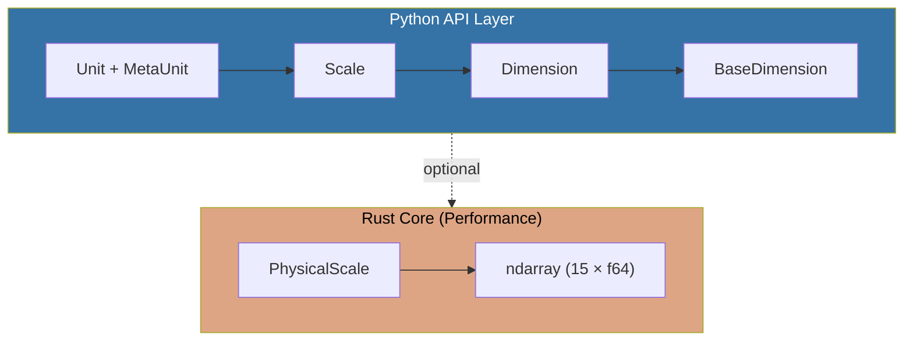

# Physities


[](https://github.com/CenturyBoys/physities/actions/workflows/publish.yml)
[](https://codecov.io/gh/CenturyBoys/physities)
[](https://pypi.org/project/physities/)
[](https://pypi.org/project/physities/)
[](https://opensource.org/licenses/MIT)
[](https://centuryboys.github.io/physities/)

A high-performance Python library for representing and working with physical quantities and units. Features dimensional analysis, unit conversion, and mathematical operations on physical measurements, powered by a Rust core for optimal performance.

## Features

- Type-safe physical quantity operations
- Automatic dimensional analysis
- Unit conversion with compile-time dimension checking
- Elegant operator syntax (`Meter / Second` creates velocity units)
- High-performance Rust backend using ndarray for linear algebra
- **UnitArray** for batch operations on arrays of values
- NumPy interoperability
- Compact serialization (int64 encoding for dimensions)
- Database-ready serialization (`to_tuple()`, `to_dict()`)

## Installation

```bash
pip install physities
```

Or with Poetry:

```bash
poetry add physities
```

### Building from Source

Requires Rust toolchain and maturin:

```bash
# Install Rust
curl --proto '=https' --tlsv1.2 -sSf https://sh.rustup.rs | sh

# Install maturin
pip install maturin

# Build and install
maturin develop --release
```

## Quick Start

```python
from physities.src.unit import Meter, Second, Kilometer, Hour

# Create composite unit types using operator syntax
MetersPerSecond = Meter / Second
KilometersPerHour = Kilometer / Hour

# Create values
v1 = MetersPerSecond(40)      # 40 m/s
v2 = KilometersPerHour(144)   # 144 km/h

# Convert between units
v3 = v2.convert(MetersPerSecond)  # 40 m/s

# Comparison works across compatible units
assert v1 == v2  # True: 40 m/s == 144 km/h
```

## Available Units

### Base SI Units

| Dimension          | Base Unit  |
|--------------------|------------|
| Length             | Meter      |
| Mass               | Kilogram   |
| Time               | Second     |
| Temperature        | Kelvin     |
| Amount             | Unity      |
| Electric Current   | Ampere     |
| Luminous Intensity | Candela    |

### Derived Units

#### Length
Gigameter, Megameter, Kilometer, Hectometer, Decameter, Decimeter, Centimeter, Millimeter, Micrometer, Nanometer, Foot, Yard, Inch, Mile, Furlong, Rod

#### Time
Nanosecond, Microsecond, Millisecond, Centisecond, Decisecond, Minute, Hour, Day, Week, Month, Year, Decade, Century, Millennium

#### Mass
Gigagram, Megagram, Tonne, Hectogram, Decagram, Gram, Decigram, Centigram, Milligram, Microgram, Nanogram, Pound, Ounce, Stone, Carat, Grain, Slug

#### Electric Current
Gigaampere, Megaampere, Kiloampere, Milliampere, Microampere, Nanoampere

#### Amount
Dozen, Moles, Pairs, Score

#### Area
Meter2, Kilometer2, Hectare, Centimeter2, Millimeter2, Foot2, Yard2, Inch2, Mile2, Acre

#### Volume
Meter3, Liter, Kiloliter, Milliliter, Centimeter3, Foot3, Gallon, Pint, Barrel

## Examples

### Creating and Using Units

```python
from physities.src.unit import Meter, Second, Kilogram

# Create a velocity unit
Velocity = Meter / Second
v = Velocity(10)  # 10 m/s

# Create an acceleration unit
Acceleration = Meter / (Second ** 2)
a = Acceleration(9.8)  # 9.8 m/s²

# Create a force unit (Newton)
Newton = Kilogram * Meter / (Second ** 2)
force = Newton(100)  # 100 N
```

### Unit Conversion

```python
from physities.src.unit import Kilometer, Mile, Hour

# Create speed units
Kmh = Kilometer / Hour
Mph = Mile / Hour

# Convert between units
speed_kmh = Kmh(100)
speed_mph = speed_kmh.convert(Mph)
```

### Mathematical Operations

```python
from physities.src.unit import Meter, Second

Ms = Meter / Second

v1 = Ms(10)
v2 = Ms(20)

# Addition and subtraction (same units only)
v3 = v1 + v2  # 30 m/s
v4 = v2 - v1  # 10 m/s

# Multiplication and division with scalars
v5 = v1 * 2   # 20 m/s
v6 = v2 / 2   # 10 m/s

# Powers
v7 = v1 ** 2  # 100 m²/s²
```

### Creating Custom Units

```python
from physities.src.unit import Unit
from physities.src.scale import Scale
from physities.src.dimension import Dimension

# Define a custom unit
class Furlong(Unit):
    scale = Scale(
        dimension=Dimension.new_length(),
        from_base_scale_conversions=(1.0, 1.0, 1.0, 1.0, 1.0, 1.0, 1.0),
        rescale_value=201.168,  # 1 furlong = 201.168 meters
    )
    value = None

# Or derive from existing units
from physities.src.unit import Meter
MyUnit = 201.168 * Meter  # Equivalent to Furlong
```

### Batch Operations with UnitArray

For high-performance operations on many values, use `UnitArray`:

```python
from physities.src.unit import Meter, Kilometer, UnitArray
import numpy as np

# Create array of 10,000 measurements
distances = UnitArray(Meter, np.random.rand(10000) * 1000)

# Batch operations (vectorized, ~100x faster than loops)
total = distances.sum()           # Returns a single Meter
average = distances.mean()        # Returns a single Meter
doubled = distances * 2           # Returns UnitArray

# Convert all values at once
km_distances = distances.convert(Kilometer)
```

### Database Serialization

Units can be serialized for database storage:

```python
from physities.src.unit import Meter, Second
from physities.src.unit.unit import Unit

velocity = (Meter / Second)(25)

# Compact format: (si_value, dimension_int64)
data = velocity.to_tuple()  # (25.0, 61441)

# Store in database: INSERT INTO measurements (value, dimension) VALUES (25.0, 61441)

# Restore from database
restored = Unit.from_tuple(data)

# Full format (preserves original unit)
full_data = velocity.to_dict()
restored = Unit.from_dict(full_data)
```

### Using the Rust Backend Directly

For high-performance operations, you can use the Rust `PhysicalScale` directly:

```python
from physities._physities_core import PhysicalScale

# Create a velocity scale (length=1, time=-1)
scale = PhysicalScale.from_components(
    (1.0, 0.0, 0.0, -1.0, 0.0, 0.0, 0.0),  # dimension exponents
    (1000.0, 1.0, 1.0, 1.0, 1.0, 1.0, 1.0),  # conversion factors (km)
    1.0  # rescale value
)

# Operations
squared = scale.power(2)
product = scale.multiply(scale)

# Serialization
json_str = scale.to_json()
int64_encoded = scale.to_dimension_int64()

# NumPy interop
import numpy as np
arr = scale.as_numpy()
```

## Architecture

Physities uses a hybrid Python/Rust architecture for optimal performance and usability:



### Python Layer (API)

1. **BaseDimension**: Enum of 7 SI base dimensions
2. **Dimension**: Frozen dataclass combining base dimensions into composite physical dimensions
3. **Scale**: Frozen dataclass with dimension + conversion factors (uses Kobject for validation)
4. **Unit + MetaUnit**: MetaUnit metaclass enables operator overloading at the class level

### Rust Core (Performance)

The `PhysicalScale` struct provides high-performance operations:

- **Unified data structure**: 15-element ndarray (7 dimension exponents + 7 conversion factors + 1 rescale)
- **Linear algebra operations**: All physical operations implemented as vector math
- **SIMD-friendly**: Contiguous memory layout enables vectorized operations
- **Serialization**: Int64 bitwise encoding for compact dimension storage

See [docs/ARCHITECTURE.md](docs/ARCHITECTURE.md) for detailed documentation.

## API Reference

### Unit Class

The main class for working with physical quantities.

```python
class Unit:
    scale: Scale      # The scale/unit definition
    value: float      # The numeric value

    def convert(self, target: Type[Unit]) -> Unit:
        """Convert to another unit of the same dimension."""

    def to_si(self) -> Unit:
        """Convert to SI base units."""

    def to_tuple(self) -> tuple[float, int]:
        """Serialize to (si_value, dimension_int64) for database storage."""

    def to_dict(self) -> dict:
        """Serialize to dictionary with full scale information."""

    @classmethod
    def from_tuple(cls, data: tuple) -> Unit:
        """Restore from compact tuple format."""

    @classmethod
    def from_dict(cls, data: dict) -> Unit:
        """Restore from dictionary format."""
```

### UnitArray Class

High-performance batch operations on arrays of values.

```python
class UnitArray:
    unit_type: MetaUnit  # The unit class (e.g., Meter)
    values: np.ndarray   # NumPy array of values
    scale: Scale         # The scale definition

    def __init__(self, unit_type: MetaUnit, values: ArrayLike): ...

    # Arithmetic (vectorized)
    def __add__(self, other: Unit | UnitArray) -> UnitArray: ...
    def __mul__(self, scalar: float) -> UnitArray: ...

    # Reductions (return single Unit)
    def sum(self) -> Unit: ...
    def mean(self) -> Unit: ...
    def std(self) -> Unit: ...
    def min(self) -> Unit: ...
    def max(self) -> Unit: ...

    # Conversion
    def convert(self, target: MetaUnit) -> UnitArray: ...
    def to_numpy(self) -> np.ndarray: ...
```

### Scale Class

Defines unit conversion factors.

```python
@dataclass(frozen=True, slots=True)
class Scale:
    dimension: Dimension
    from_base_scale_conversions: tuple[float, ...]
    rescale_value: float

    @property
    def conversion_factor(self) -> float:
        """Total conversion factor to SI units."""

    @property
    def is_dimensionless(self) -> bool:
        """Check if scale has no dimensions."""
```

### Dimension Class

Represents physical dimensions.

```python
@dataclass(frozen=True, slots=True)
class Dimension:
    dimensions_tuple: tuple[float, ...]

    @classmethod
    def new_length(cls, power: float = 1) -> Dimension: ...
    @classmethod
    def new_mass(cls, power: float = 1) -> Dimension: ...
    @classmethod
    def new_time(cls, power: float = 1) -> Dimension: ...
    @classmethod
    def new_temperature(cls, power: float = 1) -> Dimension: ...
    @classmethod
    def new_amount(cls, power: float = 1) -> Dimension: ...
    @classmethod
    def new_electric_current(cls, power: float = 1) -> Dimension: ...
    @classmethod
    def new_luminous_intensity(cls, power: float = 1) -> Dimension: ...
    @classmethod
    def new_dimensionless(cls) -> Dimension: ...
```

### PhysicalScale (Rust)

High-performance scale operations.

```python
class PhysicalScale:
    # Properties
    length: float
    mass: float
    temperature: float
    time: float
    amount: float
    electric_current: float
    luminous_intensity: float
    rescale_value: float
    conversion_factor: float
    is_dimensionless: bool

    # Operations
    def multiply(self, other: PhysicalScale) -> PhysicalScale: ...
    def divide(self, other: PhysicalScale) -> PhysicalScale: ...
    def power(self, exp: float) -> PhysicalScale: ...
    def multiply_scalar(self, scalar: float) -> PhysicalScale: ...

    # Serialization
    def to_json(self) -> str: ...
    def to_dimension_int64(self) -> int: ...

    @staticmethod
    def from_json(json_str: str) -> PhysicalScale: ...
    @staticmethod
    def from_dimension_int64(encoded: int) -> PhysicalScale: ...
```

### BaseDimension Enum

The 7 SI base dimensions:

```python
class BaseDimension(IntEnum):
    LENGTH = 0
    MASS = 1
    TEMPERATURE = 2
    TIME = 3
    AMOUNT = 4
    ELECTRIC_CURRENT = 5
    LUMINOUS_INTENSITY = 6
```

## Development

### Prerequisites

- Python 3.11+
- Rust toolchain (for building from source)
- Poetry (optional, for dependency management)

### Setup

```bash
# Clone repository
git clone https://github.com/CenturyBoys/physities.git
cd physities

# Install dependencies
pip install -e ".[dev]"

# Or with Poetry
poetry install

# Build Rust extension
maturin develop
```

### Running Tests

```bash
# Run all tests
pytest tests/ -v

# Run unit tests only
pytest tests/ -v -m unit

# Run with coverage
pytest tests/ --cov=physities
```

### Linting

```bash
# Python linting
ruff check .

# Rust linting
cargo clippy
```

### Building

```bash
# Development build
maturin develop

# Release build
maturin build --release

# Build wheels for distribution
maturin build --release -o dist
```

## Performance

Physities adds ~20x overhead vs raw Python floats for type safety. For batch operations, use `UnitArray` to get near-NumPy performance.

| Operation | Plain Python | Physities | Overhead |
|-----------|--------------|-----------|----------|
| `a + b` (floats) | ~210 ns | ~25 µs | ~120x |
| `a * b` (floats) | ~210 ns | ~48 µs | ~230x |
| Create value | ~600 ns | ~780 ns | ~1.3x |
| Create type | ~15 µs | ~39 µs | ~2.6x |

**Batch operations (UnitArray):**

| Operation | Loop (100 units) | UnitArray (100) | Speedup |
|-----------|-----------------|-----------------|---------|
| Add scalar | 2.3 ms | 22 µs | **100x** |

See [benchmarks](https://centuryboys.github.io/physities/dev/bench/) for detailed performance data.

## License

MIT

## Contributing

Contributions are welcome! Please see [CONTRIBUTING.md](CONTRIBUTING.md) for guidelines.
