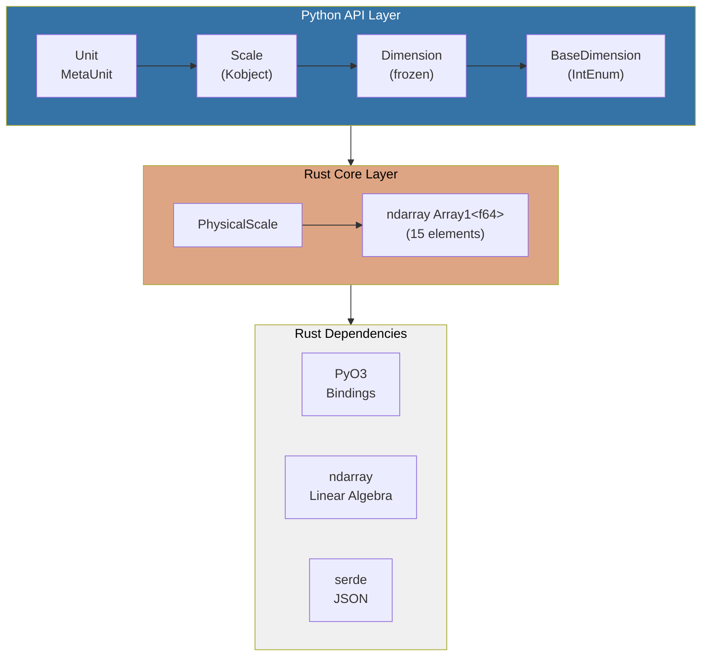
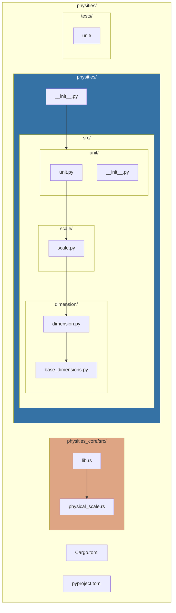
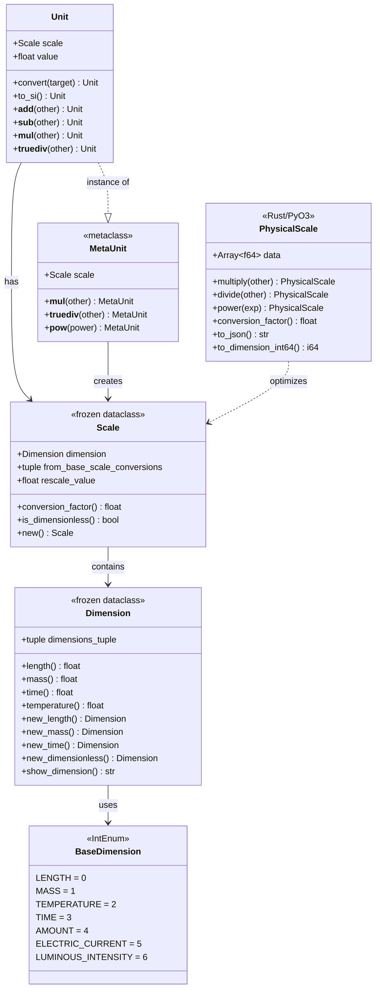
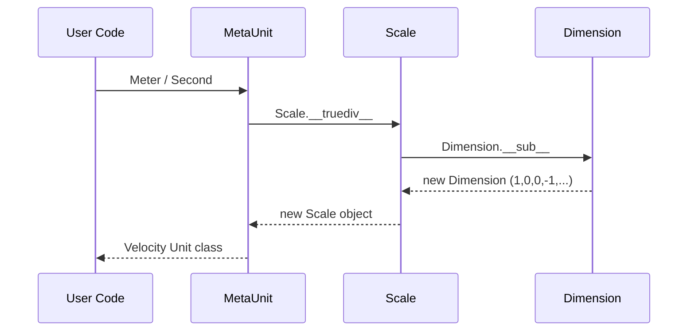
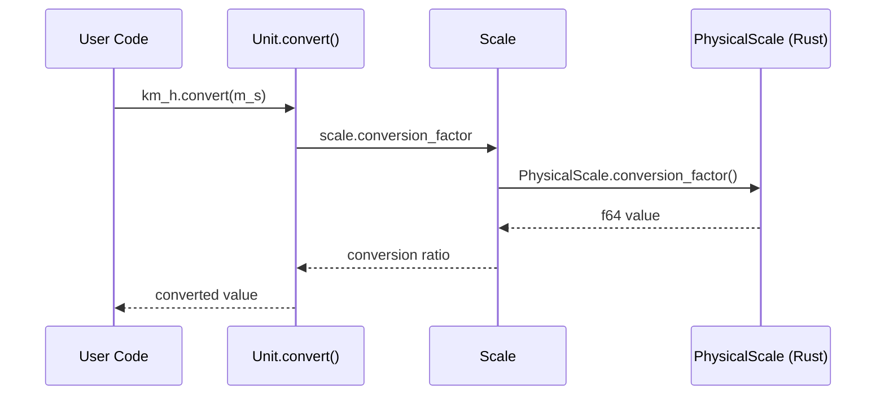
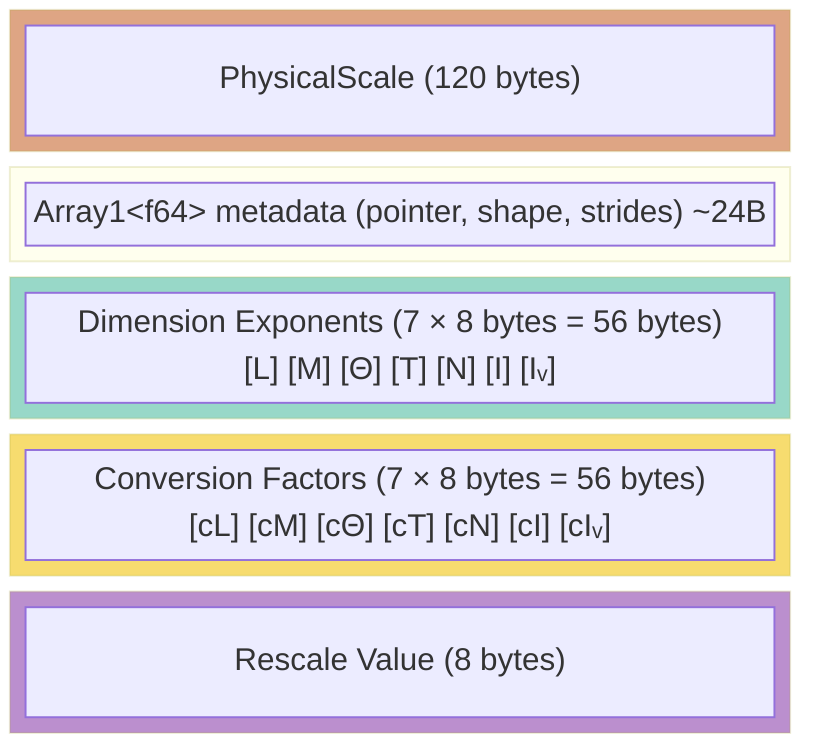
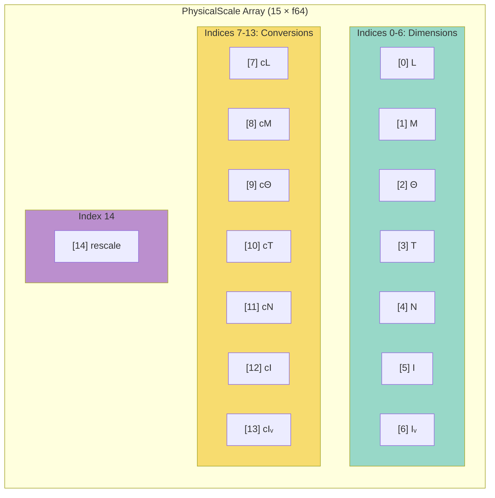

# Physities Architecture

This document describes the architecture, design decisions, and implementation approaches used in physities.

## Overview

Physities is a hybrid Python/Rust library for working with physical quantities and units. It combines Python's expressiveness for the user-facing API with Rust's performance for core operations.



## Core Concepts

### Physical Dimensions

Physical quantities have dimensions composed of 7 SI base dimensions:

| Index | Dimension           | Symbol | Example          |
|-------|---------------------|--------|------------------|
| 0     | Length              | L      | meter            |
| 1     | Mass                | M      | kilogram         |
| 2     | Temperature         | Θ      | kelvin           |
| 3     | Time                | T      | second           |
| 4     | Amount of Substance | N      | mole             |
| 5     | Electric Current    | I      | ampere           |
| 6     | Luminous Intensity  | Iᵥ     | candela          |

A dimension is represented as a tuple of exponents. For example:
- Length: `(1, 0, 0, 0, 0, 0, 0)`
- Velocity (L/T): `(1, 0, 0, -1, 0, 0, 0)`
- Force (M·L/T²): `(1, 1, 0, -2, 0, 0, 0)`

### Scale and Conversion

A **Scale** combines:
1. **Dimension exponents** - What physical quantity it represents
2. **Conversion factors** - Per-dimension conversion to SI units
3. **Rescale value** - Additional scalar multiplier

For example, kilometers per hour:
- Dimension: `(1, 0, 0, -1, 0, 0, 0)` (velocity)
- Conversion: `(1000, 1, 1, 3600, 1, 1, 1)` (km→m, hour→seconds)
- Rescale: `1.0`

### Units

**Units** are Python classes with a `Scale` attached. The **MetaUnit** metaclass enables operator overloading at the class level, allowing syntax like:

```python
Velocity = Meter / Second  # Creates a new Unit class
```

## Design Decisions

### 1. Unified Data Structure (Rust)

**Decision**: Store all scale data in a single 15-element array.

```rust
pub struct PhysicalScale {
    data: Array1<f64>,  // 15 elements
    // [0..7]  = dimension exponents
    // [7..14] = conversion factors
    // [14]    = rescale value
}
```

**Rationale**:
- **Cache efficiency**: Contiguous memory access pattern
- **SIMD-friendly**: Enables vectorized operations
- **Single allocation**: Reduces memory fragmentation
- **NumPy compatibility**: Direct interop via ndarray

### 2. Operations as Linear Algebra

**Decision**: Implement physical operations as vector operations.

| Physical Operation | Implementation |
|-------------------|----------------|
| `A * B` (multiply) | `exponents_a + exponents_b` |
| `A / B` (divide) | `exponents_a - exponents_b` |
| `A ** n` (power) | `n * exponents` |
| Conversion factor | `product(conversions) * rescale` |
| Dimension equality | `exponents_a == exponents_b` |

**Rationale**:
- Leverages ndarray's optimized implementations
- Enables potential GPU acceleration
- Simplifies implementation and reasoning

### 3. Dimension Annulation Handling

**Decision**: When dimensions cancel out during operations, conversion factors are moved to rescale.

```python
# Example: m/s * s = m
velocity_scale = Scale(dim=(1,0,0,-1,...), conv=(1,1,1,1,...))
time_scale = Scale(dim=(0,0,0,1,...), conv=(1,1,1,1,...))
result = velocity_scale * time_scale
# Result: dim=(1,0,0,0,...), conv=(1,1,1,1,...), rescale=1
```

**Rationale**:
- Preserves conversion accuracy
- Ensures `(a * b).conversion_factor == a.conv * b.conv`
- Simplifies unit comparison

### 4. Metaclass Pattern for Units

**Decision**: Use Python metaclass (`MetaUnit`) for class-level operators.

```python
class MetaUnit(type):
    def __mul__(cls, other):
        # Allows: Meter * Second
        ...
    def __truediv__(cls, other):
        # Allows: Meter / Second
        ...
```

**Rationale**:
- Enables natural syntax: `Velocity = Meter / Second`
- Type-level operations (not instance-level)
- Dynamic unit creation without boilerplate

### 5. Hybrid Python/Rust Architecture

**Decision**: Keep Python API unchanged, add Rust for performance-critical paths.

**Rationale**:
- **Backwards compatibility**: Existing code continues to work
- **Gradual adoption**: Users can opt-in to Rust backend
- **Flexibility**: Complex logic in Python, hot paths in Rust
- **Testing**: All 47 existing tests pass unchanged

### 6. Int64 Dimension Encoding

**Decision**: Compact encoding of dimensions into 64-bit integer.

```
int64 (64 bits):
├── bits 0-3:   LENGTH exponent     (4 bits, range -8 to +7)
├── bits 4-7:   MASS exponent       (4 bits)
├── bits 8-11:  TEMPERATURE         (4 bits)
├── bits 12-15: TIME exponent       (4 bits)
├── bits 16-19: AMOUNT exponent     (4 bits)
├── bits 20-23: ELECTRIC_CURRENT    (4 bits)
├── bits 24-27: LUMINOUS_INTENSITY  (4 bits)
└── bits 28-63: reserved            (36 bits)
```

**Rationale**:
- Compact storage for databases
- Fast equality comparison (single integer compare)
- Suitable for hash keys
- Supports exponents -8 to +7 (covers most physical quantities)

## Module Structure



## Class Diagram



## Data Flow

### Unit Creation



### Value Conversion (with Rust)



## Performance Characteristics

### Memory Layout



Alternative representation:



### Complexity

| Operation | Time Complexity | Space Complexity |
|-----------|----------------|------------------|
| multiply/divide | O(1) | O(1) - single alloc |
| power | O(1) | O(1) |
| conversion_factor | O(1) | O(1) |
| to_json | O(1) | O(n) - string |
| to_dimension_int64 | O(1) | O(1) |

## Extension Points

### Adding New Dimensions

The current 7-dimension model is based on SI. To add dimensions:

1. Update `BaseDimension` enum
2. Extend array size in Rust (15 → 17 for 8 dimensions)
3. Update serialization format

### Custom Serialization

The `PhysicalScale` provides multiple serialization options:

```python
# JSON (full fidelity)
scale.to_json()  # "[1.0,0.0,...,1000.0,...]"

# Int64 (dimensions only, compact)
scale.to_dimension_int64()  # 61441

# Dict (human readable)
scale.to_dict()  # {"dimensions": [...], "conversions": [...], "rescale": 1.0}
```

### NumPy Integration

```python
import numpy as np
from physities._physities_core import PhysicalScale

# Get raw array
arr = scale.as_numpy()  # numpy.ndarray shape (15,)

# Create from array
scale = PhysicalScale.from_numpy(arr)
```

## Testing Strategy

### Unit Tests (Python)

- Test all Python classes independently
- Verify operator behavior
- Check edge cases (zero, negative, fractional exponents)

### Integration Tests

- Test Python-Rust interop
- Verify serialization roundtrips
- Compare Python and Rust results

### Property Tests (recommended)

```python
from hypothesis import given, strategies as st

@given(st.floats(), st.floats())
def test_multiply_associative(a, b):
    # (scale_a * scale_b) * scale_c == scale_a * (scale_b * scale_c)
    ...
```

## Future Considerations

1. **GPU Acceleration**: ndarray supports GPU backends
2. **Uncertainty Propagation**: Add uncertainty tracking to values
3. **Unit Registry**: Global registry for custom units
4. **Caching**: Memoize common unit combinations
5. **Type Hints**: Full typing for IDE support
