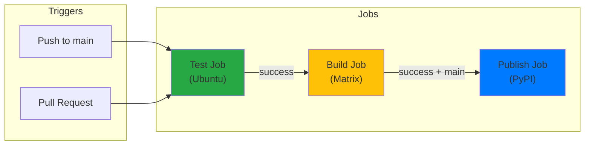
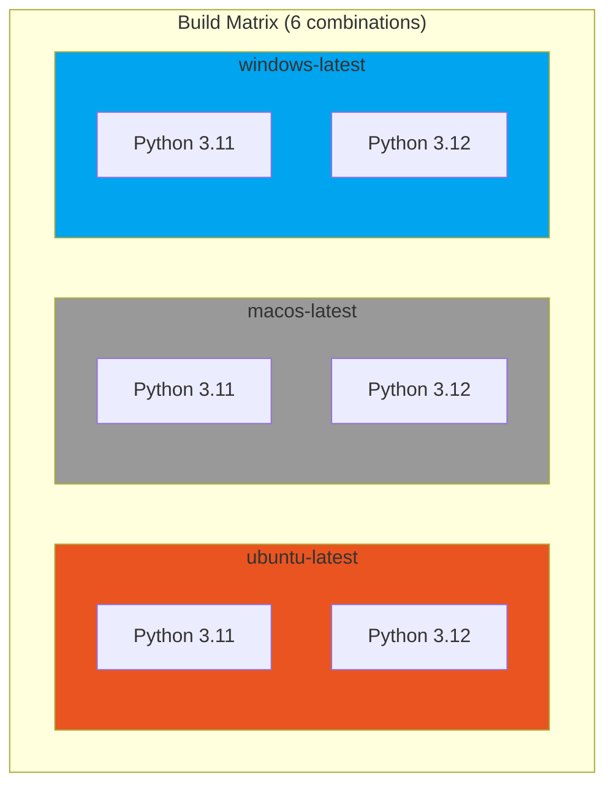

# Physities Configuration Guide

This document explains the configuration files and build setup used in physities.

## Project Structure

```
physities/
├── Cargo.toml              # Rust package configuration
├── pyproject.toml          # Python package + maturin build config
├── physities_core/
│   └── src/
│       ├── lib.rs          # Rust module entry point
│       └── physical_scale.rs
├── physities/              # Python source
├── tests/                  # Test suite
├── docs/                   # Documentation
└── .github/
    └── workflows/
        └── publish.yml     # CI/CD pipeline
```

## Python Configuration (pyproject.toml)

### Package Metadata

```toml
[project]
name = "physities"
version = "0.1.3"
description = "A Python library for physical quantities and units"
authors = [{name = "M4tus4l3m", email = "lucas.sievers@gmail.com"}]
requires-python = ">=3.11"
license = "MIT"
```

### Dependencies

```toml
dependencies = [
    "kobject>=0.6.1,<1.0.0",  # Attribute validation for Scale
]

[project.optional-dependencies]
dev = [
    "pytest>=8.0.0",         # Testing
    "ruff>=0.9.0",           # Linting
    "maturin>=1.0,<2.0",     # Rust build tool
]
```

**Why these dependencies?**

- **kobject**: Provides attribute validation for the `Scale` dataclass, ensuring type safety at runtime
- **pytest**: Industry-standard testing framework
- **ruff**: Fast Python linter written in Rust
- **maturin**: Build tool for PyO3 Rust extensions

### Build System

```toml
[build-system]
requires = ["maturin>=1.0,<2.0"]
build-backend = "maturin"

[tool.maturin]
features = ["pyo3/extension-module"]
module-name = "physities._physities_core"
python-source = "."
```

**Key settings explained:**

| Setting | Purpose |
|---------|---------|
| `build-backend = "maturin"` | Use maturin instead of setuptools |
| `features = ["pyo3/extension-module"]` | Enable Python extension mode |
| `module-name = "physities._physities_core"` | Import path for Rust module |
| `python-source = "."` | Python source at project root |

### Linting Configuration

```toml
[tool.ruff]
line-length = 100
target-version = "py311"

[tool.ruff.lint]
select = ["E", "F", "W", "I"]
ignore = ["E501", "F401", "F403", "F405", "E741", "W292", "I001", "F541", "F841", "E721"]
```

**Rules explained:**

| Rule | Description | Why Ignored |
|------|-------------|-------------|
| E | pycodestyle errors | Enabled |
| F | Pyflakes | Enabled |
| W | pycodestyle warnings | Enabled |
| I | isort | Enabled |
| E501 | Line too long | Flexible line length |
| F401 | Unused import | Star imports in `__init__.py` |
| F403 | Star import | Intentional for re-exports |

### Test Configuration

```toml
[tool.pytest.ini_options]
markers = [
    "unit: marks tests as unit tests",
]
```

## Rust Configuration (Cargo.toml)

### Package Setup

```toml
[package]
name = "physities_core"
version = "0.1.3"
edition = "2021"
authors = ["M4tus4l3m <lucas.sievers@gmail.com>"]
description = "Rust core for physities physical quantities library"
license = "MIT"
```

### Library Configuration

```toml
[lib]
name = "_physities_core"           # Module name (underscore prefix = private)
crate-type = ["cdylib"]            # Dynamic library for Python
path = "physities_core/src/lib.rs" # Source location
```

**Why `cdylib`?**

- Creates a C-compatible dynamic library (.so/.dll/.dylib)
- Required for Python extension modules
- Enables PyO3 bindings

### Dependencies

```toml
[dependencies]
pyo3 = { version = "0.28", features = ["extension-module"] }
ndarray = "0.17"
numpy = "0.28"
serde = { version = "1.0", features = ["derive"] }
serde_json = "1.0"
```

**Dependency purposes:**

| Dependency | Purpose | Version Rationale |
|------------|---------|-------------------|
| pyo3 | Python bindings | 0.28 supports Python 3.14 |
| ndarray | N-dimensional arrays | Latest stable |
| numpy | NumPy interop | Matches pyo3 version |
| serde | Serialization framework | Industry standard |
| serde_json | JSON support | Matches serde version |

### PyO3 Features

```toml
pyo3 = { version = "0.28", features = ["extension-module"] }
```

The `extension-module` feature:
- Disables linking to libpython
- Required for building standalone wheels
- Enables `#[pymodule]` attribute

## CI/CD Configuration (.github/workflows/publish.yml)

### Workflow Overview



### Build Matrix



### Workflow Triggers

```yaml
on:
  push:
    branches:
      - main
  pull_request:
    branches:
      - main
```

- Runs on pushes to main
- Runs on PRs targeting main
- Publishing only happens on main branch pushes

### Test Job

```yaml
test:
  runs-on: ubuntu-latest
  steps:
    - uses: actions/checkout@v4
    - uses: actions/setup-python@v5
      with:
        python-version: '3.11'
    - uses: dtolnay/rust-action@stable
    - run: pip install maturin pytest ruff kobject
    - run: maturin build --release
    - run: pip install target/wheels/*.whl
    - run: ruff check .
    - run: pytest tests/ -v
```

**Steps explained:**

1. **Checkout**: Get source code
2. **Setup Python**: Install Python 3.11
3. **Setup Rust**: Install stable Rust toolchain
4. **Install deps**: Build tools and test dependencies
5. **Build**: Compile Rust extension
6. **Install**: Install built wheel
7. **Lint**: Check code style
8. **Test**: Run test suite

### Build Matrix

```yaml
build:
  strategy:
    matrix:
      os: [ubuntu-latest, macos-latest, windows-latest]
      python-version: ['3.11', '3.12']
```

This creates 6 build combinations:
- Ubuntu + Python 3.11
- Ubuntu + Python 3.12
- macOS + Python 3.11
- macOS + Python 3.12
- Windows + Python 3.11
- Windows + Python 3.12

### Maturin Action

```yaml
- uses: PyO3/maturin-action@v1
  with:
    command: build
    args: --release -o dist
```

The official maturin GitHub Action:
- Handles Rust toolchain setup
- Builds platform-specific wheels
- Outputs to `dist/` directory

### Publishing

```yaml
publish:
  needs: build
  if: github.event_name == 'push' && github.ref == 'refs/heads/main'
  steps:
    - uses: actions/download-artifact@v4
      with:
        path: dist
        merge-multiple: true
    - run: twine upload dist/*.whl --skip-existing
```

**Security:**

- Uses `PYPI_API_TOKEN` secret for authentication
- `--skip-existing` prevents republishing same version
- Only runs on main branch

## Git Ignore (.gitignore)

### Rust Artifacts

```gitignore
# Rust
target/           # Build output
Cargo.lock        # Lock file (library, not committed)
*.pdb             # Windows debug symbols
```

### Maturin Outputs

```gitignore
# Maturin
*.so              # Linux shared objects
*.pyd             # Windows Python extensions
*.dll             # Windows DLLs
```

### Python Artifacts

```gitignore
__pycache__/
*.py[cod]
*.egg-info/
dist/
build/
.pytest_cache/
```

## Development Workflow

### Local Development

```bash
# 1. Clone and setup
git clone https://github.com/user/physities.git
cd physities

# 2. Create virtual environment
python -m venv .venv
source .venv/bin/activate

# 3. Install dev dependencies
pip install -e ".[dev]"

# 4. Build Rust extension
maturin develop

# 5. Run tests
pytest tests/ -v

# 6. Lint
ruff check .
cargo clippy
```

### Release Process

```bash
# 1. Update version in:
#    - pyproject.toml
#    - Cargo.toml

# 2. Commit changes
git add -A
git commit -m "chore: version X.Y.Z"

# 3. Tag release
git tag vX.Y.Z

# 4. Push to trigger CI
git push origin main --tags
```

### Environment Variables

| Variable | Purpose | Where Set |
|----------|---------|-----------|
| `PYPI_API_TOKEN` | PyPI authentication | GitHub Secrets |
| `PYO3_PYTHON` | Python interpreter path | Local dev (optional) |

## Troubleshooting

### Python Version Mismatch

```
error: the configured Python interpreter version (3.14) is newer than PyO3's maximum supported version
```

**Solution**: Update PyO3 to latest version in Cargo.toml

### Missing Rust Toolchain

```
error: could not find `cargo` in PATH
```

**Solution**: Install Rust via rustup:
```bash
curl --proto '=https' --tlsv1.2 -sSf https://sh.rustup.rs | sh
```

### Maturin Build Fails

```
maturin failed: Failed to parse Cargo.toml
```

**Solution**: Ensure Cargo.toml has `[package]` section (not workspace-only)

### Import Error After Build

```
ImportError: cannot import name '_physities_core'
```

**Solution**: Rebuild with `maturin develop` after Rust changes
