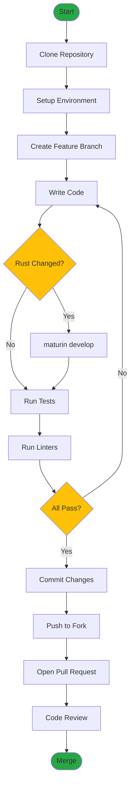
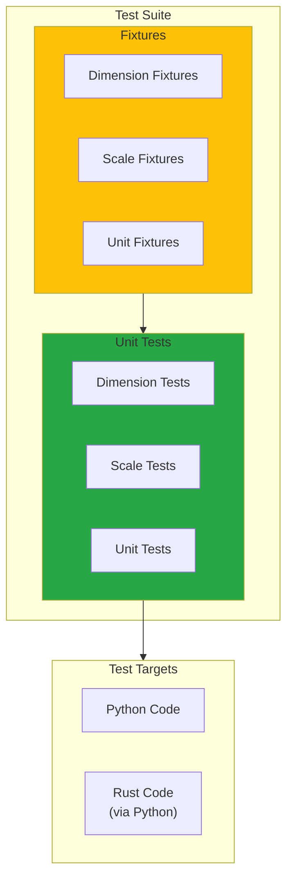
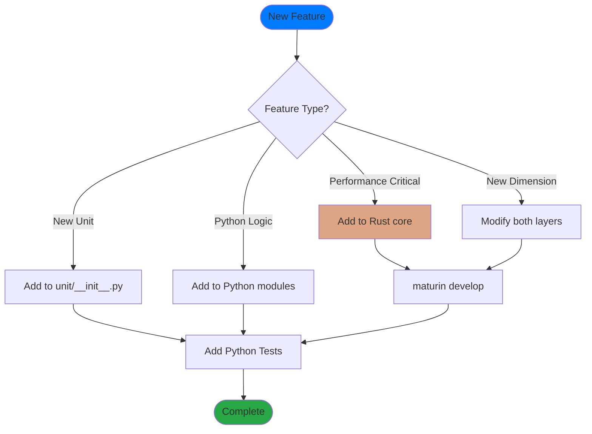
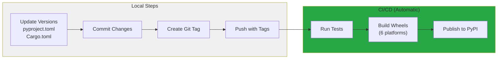

# Physities Development Guide

This guide covers development workflows, coding standards, and best practices for contributing to physities.

## Development Workflow Overview



## Getting Started

### Prerequisites

- Python 3.11 or later
- Rust toolchain (rustc 1.70+)
- Git

### Setup

```bash
# Clone the repository
git clone https://github.com/your-username/physities.git
cd physities

# Install Rust (if not installed)
curl --proto '=https' --tlsv1.2 -sSf https://sh.rustup.rs | sh
source $HOME/.cargo/env

# Create virtual environment
python -m venv .venv
source .venv/bin/activate  # Linux/macOS
# or
.venv\Scripts\activate     # Windows

# Install development dependencies
pip install -e ".[dev]"

# Build Rust extension
maturin develop

# Verify installation
pytest tests/ -v
```

## Project Layout

```
physities/
├── physities_core/src/    # Rust source code
│   ├── lib.rs             # Module entry point
│   └── physical_scale.rs  # Core implementation
├── physities/src/         # Python source code
│   ├── dimension/         # Dimension handling
│   ├── scale/             # Scale implementation
│   └── unit/              # Unit classes
├── tests/                 # Test suite
│   ├── fixtures/          # Shared test fixtures
│   └── unit/              # Unit tests
├── docs/                  # Documentation
└── .github/workflows/     # CI/CD
```

## Development Workflow

### Making Changes

1. **Create a feature branch**
   ```bash
   git checkout -b feat/your-feature
   ```

2. **Make changes**
   - Python code in `physities/`
   - Rust code in `physities_core/src/`

3. **Rebuild Rust extension (if modified)**
   ```bash
   maturin develop
   ```

4. **Run tests**
   ```bash
   pytest tests/ -v
   ```

5. **Lint your code**
   ```bash
   ruff check .
   cargo clippy
   ```

6. **Commit with conventional commits**
   ```bash
   git commit -m "feat: add new feature"
   ```

### Running Tests

```bash
# All tests
pytest tests/ -v

# Unit tests only
pytest tests/ -v -m unit

# Specific test file
pytest tests/unit/unit/test_unit.py -v

# Specific test
pytest tests/unit/unit/test_unit.py::TestUnit::test_conversion -v

# With coverage
pytest tests/ --cov=physities --cov-report=html
```

### Debugging

```bash
# Python debugging
python -m pytest tests/ -v --pdb

# Rust debugging (compile with debug symbols)
maturin develop  # Uses debug profile by default

# Print Rust debug output
RUST_BACKTRACE=1 python -c "from physities._physities_core import PhysicalScale; ..."
```

## Coding Standards

### Python Style

- Follow PEP 8
- Use type hints where possible
- Maximum line length: 100 characters
- Use docstrings for public APIs

```python
from dataclasses import dataclass
from typing import Self


@dataclass(frozen=True, slots=True)
class Example:
    """A well-documented class.

    Attributes:
        value: The numeric value.
    """
    value: float

    def method(self) -> Self:
        """Return a new instance with modified value."""
        return Example(value=self.value * 2)
```

### Rust Style

- Follow Rust API Guidelines
- Use rustfmt for formatting
- Document public items

```rust
use pyo3::prelude::*;

/// A well-documented struct.
///
/// # Example
///
/// ```
/// let scale = PhysicalScale::new();
/// assert!(scale.is_dimensionless());
/// ```
#[pyclass]
pub struct Example {
    value: f64,
}

#[pymethods]
impl Example {
    /// Create a new Example.
    #[new]
    pub fn new() -> Self {
        Self { value: 0.0 }
    }
}
```

### Commit Messages

Use [Conventional Commits](https://www.conventionalcommits.org/):

```
feat: add new feature
fix: resolve bug in conversion
docs: update README
chore: update dependencies
refactor: restructure module
test: add unit tests for Scale
```

## Testing Guidelines

### Test Architecture



### Test Structure

```python
import pytest
from physities.src.unit import Meter, Second


@pytest.mark.unit
class TestMyFeature:
    """Test suite for MyFeature."""

    @staticmethod
    def test_basic_functionality():
        """Test basic operation."""
        result = Meter(10) / Second(2)
        assert result.value == 5

    @staticmethod
    def test_edge_case():
        """Test edge case with zero."""
        with pytest.raises(ZeroDivisionError):
            Meter(10) / Second(0)
```

### Fixture Usage

```python
# tests/fixtures/fixtures.py
import pytest
from physities.src.dimension import Dimension


@pytest.fixture
def velocity_dimension():
    return Dimension.new_instance((1, 0, 0, -1, 0, 0, 0))


# tests/unit/test_example.py
def test_with_fixture(velocity_dimension):
    assert velocity_dimension.length == 1
    assert velocity_dimension.time == -1
```

### Test Categories

| Marker | Purpose |
|--------|---------|
| `@pytest.mark.unit` | Fast, isolated unit tests |
| `@pytest.mark.integration` | Tests with external dependencies |
| `@pytest.mark.slow` | Long-running tests |

## Adding New Features

### Feature Decision Flow



### Adding a New Unit

1. **Add to `physities/src/unit/__init__.py`**:
   ```python
   # Define from existing units
   NewUnit = 1234.56 * Meter

   # Or define with custom scale
   class NewUnit(Unit):
       scale = Scale(
           dimension=Dimension.new_length(),
           from_base_scale_conversions=(1.0, 1.0, 1.0, 1.0, 1.0, 1.0, 1.0),
           rescale_value=1234.56,
       )
       value = None
   ```

2. **Add tests**:
   ```python
   def test_new_unit_conversion():
       nu = NewUnit(1)
       m = nu.convert(Meter)
       assert m.value == 1234.56
   ```

### Adding a Rust Operation

1. **Add to `physities_core/src/physical_scale.rs`**:
   ```rust
   #[pymethods]
   impl PhysicalScale {
       /// New operation description.
       pub fn new_operation(&self, param: f64) -> PhysicalScale {
           let mut result = self.clone();
           // Implementation
           result
       }
   }
   ```

2. **Rebuild**:
   ```bash
   maturin develop
   ```

3. **Test from Python**:
   ```python
   from physities._physities_core import PhysicalScale

   def test_new_operation():
       scale = PhysicalScale()
       result = scale.new_operation(2.0)
       assert result.conversion_factor == expected
   ```

### Adding a New Dimension

1. **Update `BaseDimension` enum**:
   ```python
   class BaseDimension(IntEnum):
       # ... existing ...
       NEW_DIMENSION = 7
   ```

2. **Update array sizes in Rust**:
   ```rust
   // Change 15 to 17 (8 dims + 8 convs + 1 rescale)
   let mut data = Array1::zeros(17);
   ```

3. **Update serialization**:
   - JSON: Array length changes
   - Int64: Add 4 bits for new dimension

## Performance Considerations

### Python vs Rust

Use Rust for:
- Numerical operations
- Loops over arrays
- Hot paths called frequently

Keep in Python:
- Complex control flow
- API surface
- Integration with other Python libraries

### Profiling

```bash
# Python profiling
python -m cProfile -o profile.prof your_script.py
python -m pstats profile.prof

# Rust profiling
cargo build --release
perf record ./target/release/benchmark
perf report
```

### Benchmarking

```python
import timeit

# Benchmark Python vs Rust
python_time = timeit.timeit(
    'scale1 * scale2',
    setup='from physities.src.scale import Scale; ...',
    number=10000
)

rust_time = timeit.timeit(
    'scale1.multiply(scale2)',
    setup='from physities._physities_core import PhysicalScale; ...',
    number=10000
)

print(f"Python: {python_time:.4f}s, Rust: {rust_time:.4f}s")
```

## Release Process



### Steps

1. **Update version numbers**:
   - `pyproject.toml`: `version = "X.Y.Z"`
   - `Cargo.toml`: `version = "X.Y.Z"`

2. **Update CHANGELOG** (if present)

3. **Create release commit**:
   ```bash
   git add -A
   git commit -m "chore: release vX.Y.Z"
   ```

4. **Tag release**:
   ```bash
   git tag vX.Y.Z
   git push origin main --tags
   ```

5. **CI automatically**:
   - Runs tests
   - Builds wheels for all platforms
   - Publishes to PyPI

## Troubleshooting

### Common Issues

**"Module not found" after Rust changes**:
```bash
maturin develop  # Rebuild
```

**Tests fail with import errors**:
```bash
pip install -e ".[dev]"  # Reinstall
```

**Rust compilation errors**:
```bash
cargo check  # Check without building
cargo build 2>&1 | head -50  # See first errors
```

**Maturin version mismatch**:
```bash
pip install --upgrade maturin
```

### Getting Help

- Check existing issues on GitHub
- Review the documentation in `docs/`
- Ask in discussions/issues

## Code Review Checklist

- [ ] Tests pass locally
- [ ] Code is linted (`ruff check .`, `cargo clippy`)
- [ ] New features have tests
- [ ] Documentation is updated
- [ ] Commit messages follow conventions
- [ ] No breaking changes (or documented)
- [ ] Performance is considered
